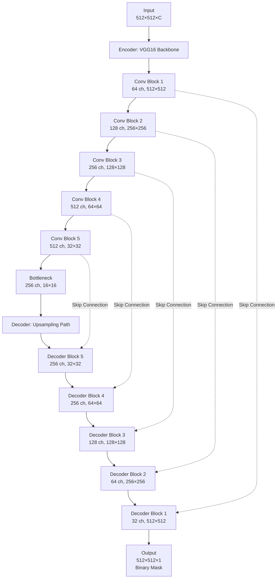

# Building Footprint Extraction from Satellite Imagery

Automatic building footprint extraction from satellite imagery using deep learning. This project implements a VGG16-UNet architecture for semantic segmentation to detect and extract building footprints from SpaceNet 2 Las Vegas dataset.

## Project Overview

**Goal**: Automatic building footprint extraction from satellite 
imagery using deep learning.

**Dataset**: SpaceNet 2 - Las Vegas building footprints  

**Task**: Semantic segmentation (binary classification: building vs. background)

## Model Architecture: VGG16-UNet

### High-Level Structure



### Key Features

- **Encoder**: Modified VGG16 (first layer adapted for 3 input channels)
- **Decoder**: Upsampling blocks with skip connections (U-Net architecture)
- **Input Channels**: 3 channels (RGB satellite imagery)
- **Output**: Binary segmentation mask (building footprints)

## Installation

### Prerequisites

- Python 3.7+
- PyTorch
- CUDA (for GPU acceleration)

### Setup

1. Clone the repository:
```bash
git clone <repository-url>
cd aws-open-data-satellite-lidar-tutorial
```

2. Set up the environment (if using pyenv):
```bash
bash setup-pyenv-env.sh
```

## Workflow

### Phase 1: Data Preparation
1. **Download** satellite imagery from AWS S3
2. **Load** GeoJSON building annotations
3. **Generate** binary masks from polygons
4. **Split** data into train/test sets (CSV files)

### Phase 2: Model Training
1. **Configure** training parameters (YAML config)
2. **Initialize** VGG16-UNet model with 3 input channels
3. **Train** for 100 epochs:
   - Forward pass through encoder-decoder
   - Compute loss (BCE + Jaccard)
   - Backward pass and weight update
   - Validation every epoch
   - Checkpoint every 10 epochs
4. **Save** final model checkpoint

### Phase 3: Inference
1. **Load** trained model checkpoint
2. **Run** inference on test images
3. **Generate** prediction masks (probability maps)
4. **Convert** masks to polygon GeoJSON files

### Phase 4: Evaluation
1. **Match** predicted polygons to ground truth (IoU >= 0.5)
2. **Calculate** metrics:
   - Precision, Recall, F1 Score
   - Mean IoU (per image and average)
   - Pixel-wise IoU (optional)
3. **Compare** multiple models
4. **Visualize** results with comparison plots

## Training Configuration

### Hyperparameters
- **Epochs**: 100
- **Batch Size**: 2-20 (configurable)
- **Optimizer**: AdamW
- **Learning Rate**: 1e-4
- **Loss Function**: 
  - BCEWithLogits (weight: 10.0)
  - Jaccard Loss (weight: 2.5)

### Data Augmentation (Training)
- HorizontalFlip (p=0.5)
- RandomRotate90 (p=0.5)
- RandomCrop (512×512)
- GaussNoise (p=0.3)
- MedianBlur (p=0.2)
- Normalize

### Data Augmentation (Validation/Inference)
- CenterCrop (512×512) or Normalize only

## Evaluation Framework

We developed a comprehensive evaluation framework for systematic model comparison:

### Automated Comparison Script

The `compare_rgb_model_inference.py` script provides:

- Command-line interface for specifying multiple models
- Automated inference on shared test set
- Polygon conversion for all predictions
- Per-image and aggregate metric computation
- Side-by-side visual comparison generation
- Comprehensive CSV report generation

### Usage Example

```bash
python compare_rgb_model_inference.py \
  --model-run RGB-origin \
    configs/RGB-only.yml \
    models/RGB-origin.pth \
  --model-run RGB-augment \
    configs/RGB-only.yml \
    models/RGB-augment.pth \
  --inference-csv data/test.csv
```

### Output Structure

The framework generates organized output directories:

- `results/comparisons/`: Root comparison directory
- `RGB-origin/`: Model-specific results (masks, polygons, metrics)
- `RGB-augment/`: Model-specific results
- `comparison_average_metrics.csv`: Cross-model comparison
- `all_models_per_image_metrics.csv`: Detailed per-image data
- `image-comparison/`: Visual comparison plots for each test image

## Evaluation Metrics

### Polygon-Based Metrics
- **True Positives (TP)**: Predicted polygons with IoU ≥ 0.5
- **False Positives (FP)**: Predicted polygons with IoU < 0.5
- **False Negatives (FN)**: Ground truth polygons not matched
- **Precision**: TP / (TP + FP)
- **Recall**: TP / (TP + FN)
- **F1 Score**: 2 × (Precision × Recall) / (Precision + Recall)
- **Mean IoU**: Average IoU of all matched polygon pairs

### Pixel-Based Metrics (Optional)
- **Pixel IoU**: Intersection over Union at pixel level

## Model Variants

1. **RGB-only**: 3-channel input (satellite imagery)

## Usage Examples

### Training

```bash
python building_footprint_rgb_training.py
```

### Model Comparison

```bash
python compare_rgb_model_inference.py \
    --model-run RGB-origin configs/buildings/RGB-only.yml models/buildings/RGB-only.pth \
    --model-run RGB-augment configs/buildings/RGB-only.yml models/buildings/RGB-augment.pth \
    --inference-csv ./data/buildings/split_blind_test.csv
```

## Project Structure

```
aws-open-data-satellite-lidar-tutorial/
├── building_footprint_rgb_training.py      # Training script
├── compare_rgb_model_inference.py         # Model comparison script
├── networks/
│   ├── vgg16_unet.py                      # VGG16-UNet architecture
│   └── resnet_unet.py                     # ResNet-UNet (alternative)
├── configs/buildings/
│   └── RGB-only.yml                       # RGB-only config
├── data/buildings/
│   ├── RGB/                               # Input images
│   ├── mask_buildings/                    # Ground truth masks
│   └── geojson_buildings/                 # Ground truth polygons
├── models/buildings/                      # Trained model checkpoints
└── results/buildings/                     # Inference results
```

## Output Files Structure

```
results/buildings/comparisons/
├── comparison_average_metrics.csv          # Average metrics across all images
├── all_models_per_image_metrics.csv        # Per-image metrics for all models
├── image-comparison/                       # Comparison plots
│   ├── img1002_comparison.png
│   ├── img1006_comparison.png
│   └── ...
├── RGB-origin/
│   ├── per_image_metrics.csv               # This model's per-image metrics
│   ├── metrics_summary.csv                 # This model's average metrics
│   ├── pred_mask/                          # Prediction masks
│   └── prop_geojson/                       # Prediction polygons
└── RGB-augment/
    ├── per_image_metrics.csv
    ├── metrics_summary.csv
    ├── pred_mask/
    └── prop_geojson/
```

## Key Technologies

- **Deep Learning Framework**: PyTorch
- **ML Library**: Solaris (geospatial ML toolkit)
- **Data Format**: GeoTIFF (images), GeoJSON (annotations)
- **Evaluation**: Solaris Evaluator (IoU-based)
- **Visualization**: Matplotlib

## Performance Metrics

Typical performance on SpaceNet 2 Las Vegas dataset:
- **Precision**: ~0.88-0.92
- **Recall**: ~0.80-0.85
- **F1 Score**: ~0.86-0.91
- **Mean IoU**: Varies by image (typically 0.5-0.8)

## License

See the LICENSE files in the `data/` and `models/` directories for dataset and model licensing information.

## References

- SpaceNet 2 Dataset: [AWS Open Data](https://registry.opendata.aws/spacenet/)
- Solaris: [CosmiQ Works](https://github.com/CosmiQ/solaris)

